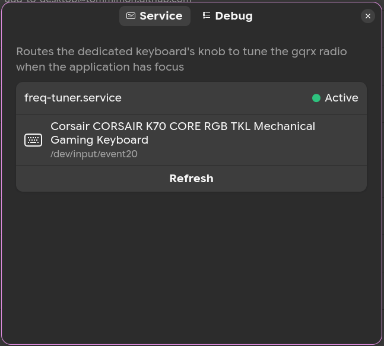

# freq-tuner

Tune **gqrx** with the volume knob on your keyboard.

> **Requires a keyboard with a dedicated volume knob** (typically found on
> mechanical keyboards). Without a physical knob there is nothing to route.

When gqrx is the focused application, turning the knob on your keyboard tunes
the radio receiver instead of changing the system volume. In every other
window the knob behaves normally.

## How it works

Your keyboard's volume knob becomes a dedicated tuning dial. While the gqrx
window is focused, every turn of the knob is sent to the receiver instead of
changing the system volume.

- **The knob** — a keyboard grabber exposes your physical knob as a virtual
  device, so it can be routed without affecting anything else.
- **The router** — `freq-tuner` watches that device and forwards knob turns
  to gqrx.
- **The focus check** — a GNOME Shell extension tells the router which window
  is currently focused. The knob tunes gqrx only when gqrx is the active
  window; in every other app it works exactly as before.

**Default behavior** — by default the knob keeps its normal behavior. Only
when gqrx is focused and responding does it tune the receiver instead.

## Using the knob

While gqrx is focused, the knob tunes the receiver:

- **Turn the knob** to step the frequency. The step size follows the filter
  width gqrx is using right now, so tuning always matches the current zoom.
- **Press the knob** to toggle between coarse tuning (one full filter width
  per step) and fine tuning (one tenth of a filter width per step).

The knob push never reaches the system, so pressing it while gqrx is focused
only changes the tuning mode.

## Components

- **`freq-tuner`** — the router service (`src/`). Reads evdev events on stdin,
  writes them on stdout, and routes ticks to the plugin matching the focused
  application. Plugins live in `src/plugins/` (see
  [`src/plugins/README.md`](src/plugins/README.md) to write one).
- **`knobprobe`** — a read-only probe that lists virtual event devices
  exposing the volume-knob keys (EVIOCGBIT only, never grabs).
- **GNOME Shell extension** (`extension.js`, `prefs.js`, `schemas/`) — watches
  focus changes and sends the focused window's `WM_CLASS` as a datagram to the
  service's UNIX DGRAM socket.

## Requirements

- **A keyboard with a volume knob** — the knob is the input device freq-tuner
  routes, so a keyboard with a rotary volume knob (common on mechanical
  keyboards) is required.
- **interception-tools** — provides the `interception` and `uinput` commands
  that grab the knob's virtual device and publish the routed events, running
  the pipeline (`interception -g DEVICE | freq-tuner | uinput -d DEVICE`).
  On Ubuntu/Debian it is installed automatically by `install.sh`
  (`sudo apt install interception-tools`), or install it beforehand.
- **[gqrx](https://gqrx.dk/) with remote control enabled** — the router talks
  to gqrx over its remote-control port to set the frequency. Remote control is
  a built-in gqrx feature (default `127.0.0.1:7356`); enable it in gqrx's
  settings. gqrx is currently the only supported application; other SDR
  software can be supported by writing a plugin
  ([`src/plugins/README.md`](src/plugins/README.md)).
- **GNOME Shell 50** — required by the focus-watcher extension.
- **Build tools** — a C compiler, `make`, and the kernel headers
  (`linux-libc-dev`, which provides `/usr/include/linux/input.h`). On
  Ubuntu/Debian:

      sudo apt install build-essential linux-libc-dev

  plus `glib-compile-schemas` (from `libglib2.0-bin`) to install the
  extension's settings.

## Build

    make

Produces `freq-tuner`, `knobprobe`, and the extension bundle
`freq-tuner@neural75.github.com.shell-extension.zip`.

## Install the service

    sudo ./install.sh [gqrx_host] [gqrx_port]

The installer detects the virtual knob device, writes
`/etc/freq-tuner/config`, installs the binaries and the systemd unit
`freq-tuner.service`, starts it, and installs the GNOME Shell extension for
the session user.

> **After the script finishes, log out and back in** so GNOME Shell picks up the
> newly installed extension, then enable it:
>
> - in **Extension Manager**: find **freq-tuner** and turn it on, or
> - from a terminal: `gnome-extensions enable freq-tuner@neural75.github.com`

> The service is started but **not enabled** at boot: a reboot restores the
> original configuration.

Status: `./status.sh`

Uninstall: `sudo ./uninstall.sh`

## Install the extension manually

`./install.sh` already does this. Use these steps only when you rebuilt the
extension yourself or installed the service without the extension.

Build the extension bundle (also built by a plain `make`):

    make extension

Then install and enable it:

    gnome-extensions install freq-tuner@neural75.github.com.shell-extension.zip
    gnome-extensions enable freq-tuner@neural75.github.com

A session restart picks up a newly installed extension. The extension's
preferences show the service status, the grabbed knob device, and where to
find the debug log (`journalctl --user -f | grep freq-tuner`).

  <picture>
    <source srcset="./media/freq-tuner-extension.png" > 
    
  </picture>

## Configuration

Edit `/etc/freq-tuner/config` and restart the service to apply:

    DEVICE=/dev/input/eventX     # virtual knob device to grab
    DEVNAME="..."                # human-readable device name
    GQRX_HOST=127.0.0.1          # gqrx remote-control host
    GQRX_PORT=7356               # gqrx remote-control port
    FOCUS_SOCK=/run/freq-tuner/focus.sock
    VERBOSE=0

## License

MIT
